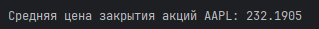
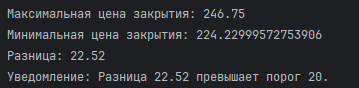
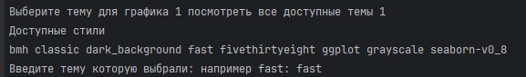

# **Анализ данных с использованием Python**

Проект для анализа и визуализации данных об акциях, запись полученных данны в файл

#  **Разработка**
### Установка зависимостей

`pip install -r requirements.txt`

### Запуск проекта

Требуется находиться в директории с файлом "project_1_main.py"

`python project_1_main.py`

### Пример начала запуска программы

### Загрузка данных акций
>Используйте функцию fetch_stock_data(ticker, period_start, period_end) для загрузки исторических данных акций по заданному тикеру и периоду.
> ##### period_start - начало периода 
> ##### period_end - конец периода 
### Добавление скользящей средней
>Функция add_moving_average(data, window_size) добавляет столбец со скользящей средней к данным.
### Расчет средней цены закрытия
>Функция calculate_and_display_average_price(data, ticker) выводит среднюю цену закрытия акций за указанный период.

### Проверка разницы цен
>Функция check_price_difference(data, threshold) уведомляет о сильных колебаниях цен, если разница между максимальной и минимальной ценой превышает заданный порог.

### Экспорт данных в CSV и Excel
>Функция export_data_to_csv(data, filename) позволяет сохранить данные в формате CSV и Excel.
> #### filename - можно указать имя файла

### Дополнительные технические индикаторы

>Функция upeman_downeman(data, column, window_size) рассчитывает индекс относительной силы (RSI) для указанного столбца.

### Добавлена возможность выбора стиля графика

# Файлы проекта
- `data_download.py`
- `data_plotting.py`
- ***`project_1_main.py`***

